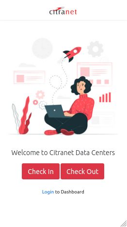

# Web-based Digital Data Center Guestbook Application


This project is the development of a data center guest book application created during an internship. Created using the Laravel framework by implementing the SDLC waterfall method, MySQL for the database, Token Auth for the authentication. The things that have been done during the application development period, including: gathering requirements, designing UML and tables, implementing the design (coding) and the result is a ready-to-use full-stack application.

------------------------------------------------------------------------
## Implementations
1. Create MySQL database</br>

2. Clone Repository </br>
    ```
    git clone https://github.com/FarhanKurnia/URL-Shortener.git
    ```

3. Install Composer </br>
    ```
    composer install
    ```

4. Copy and Set up environment</br>
    ```
    cp .env.example .env
    ```

5. Customize environment (.env) files with DB name that has been created.</br>

6. Migrate database</br>
    ```
    php artisan migrate
    ```

7. Run local server</br>
    ```
    php artisan serve
    ```

8. Access localhost:8000 or your public link</br>

9. Webcam can be access in public with SSL 